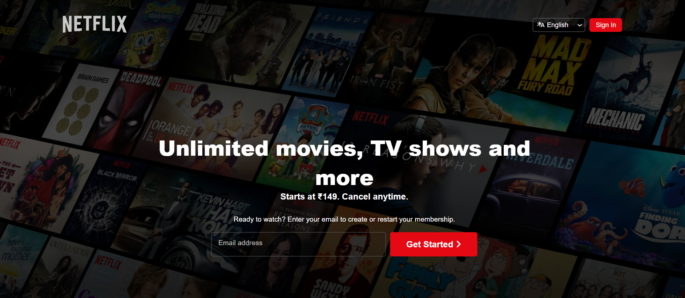
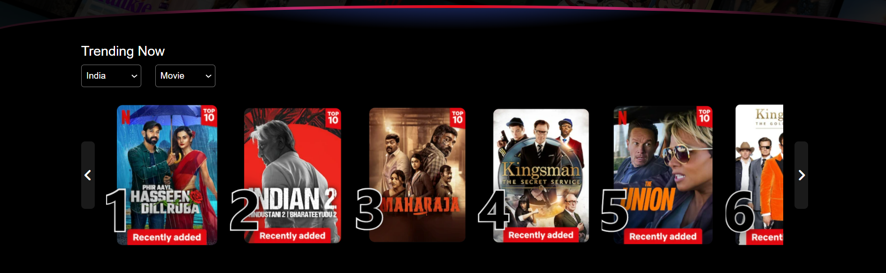
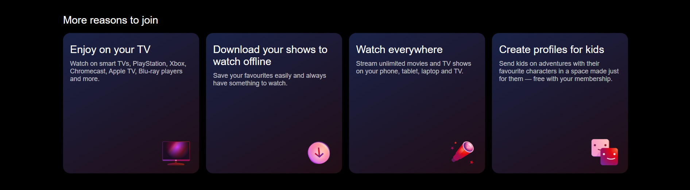
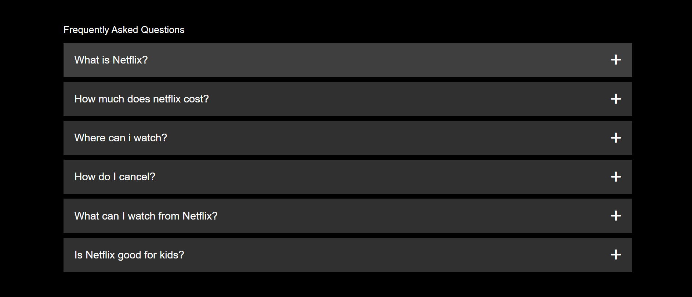
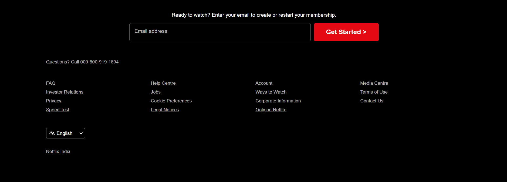

## Disclaimer
This project is a Netflix clone created solely for educational purposes. It serves as a demonstration of web development skills and is not intended for commercial use or to infringe on any copyrights or trademarks owned by Netflix.

The website is a personal project, and I am not affiliated with or endorsed by Netflix in any way. All elements of this project, including the design and functionality, are recreations meant to mimic the Netflix interface, and no real Netflix content (such as movies, shows, or proprietary media) is hosted or accessible through this project.

If you are the rightful owner of any material unintentionally used, please reach out, and I will promptly address any concerns or remove the content as necessary.
# Netflix Clone 🎥

A simple **Netflix Clone** frontend built using **HTML**, **CSS**, and **JavaScript**. This project replicates the design and basic functionality of Netflix’s main interface, including a responsive layout, movie thumbnails, and hover effects.

## 🚀 Demo

You can view the live demo [here](https://dolkersonam.github.io/NetflixClone/). 

## 📸 Screenshots

 
 
 
 
 

## 📦 Features

- **Responsive Design**: The layout adjusts for different screen sizes, including mobile, tablet, and desktop.
- **Interactive UI**: Hover effects on movie thumbnails.
- **Custom Scrollbar**: Styled scrollbar for a sleek user experience.
- **Navigation Bar**: Sticky navigation bar similar to Netflix.

## 🛠️ Technologies Used

- **HTML5**
- **CSS3**
  - Flexbox and Grid
  - CSS Animations
- **JavaScript (ES6)**

## ⚙️ Installation

To run this project locally, follow these steps:

1. **Clone the repository**:

    ```bash
    git clone https://github.com/your-username/netflix-clone.git
    ```

2. **Navigate into the project directory**:

    ```bash
    cd netflix-clone
    ```

3. **Open the `index.html` file** in your browser:

    ```bash
    open index.html
    ```
    Or use Live Server in VSCode to run the project.

## 🗂️ Project Structure

```bash
netflix-clone/
│
├── index.html          # Main HTML file
├── styles/             
│   ├── style.css       # Main CSS file
├── scripts/            
│   ├── script.js       # Main JavaScript file
├── images/             # Images used in the project
│   └── logo.png
└── README.md           # This file
